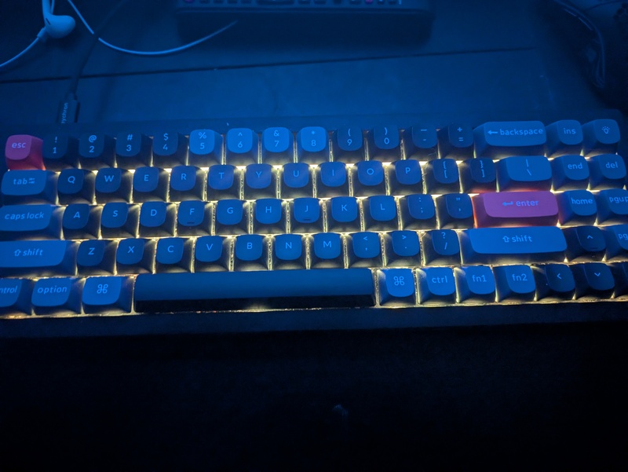

# saengsation

RGB LED controller for Keychron V7 on Linux, with Claude Code integration.

*แสง (saeng) = light + sensation*



Control your keyboard lighting from the command line, define named states for different activities, and let Claude Code change your keyboard colors based on what it's doing.

## Quickstart

```bash
# Clone
git clone git@github.com:mbarlow/saengsation.git
cd saengsation

# Build
make build

# Setup (creates plugdev group, installs udev rules)
make setup

# Log out and back in for group permissions, or:
newgrp plugdev

# Verify
make check

# Try it
./saengsation state set focus

# Optional: install Claude Code hooks
make hooks
```

## Install

### Requirements

- Linux (tested on Arch)
- [Go](https://go.dev/) 1.22+
- Keychron V7 keyboard (USB, QMK firmware)

That's it. No Python, no pip, no C libraries, no build tools beyond Go.

### Step by Step

```bash
# Build the binary
go build -o saengsation ./cmd

# Create plugdev group and add yourself
sudo groupadd plugdev
sudo usermod -aG plugdev $USER

# Install udev rules (allows non-root HID access)
sudo cp config/99-saengsation.rules /etc/udev/rules.d/
sudo udevadm control --reload-rules
sudo udevadm trigger

# Log out/in for group to take effect
```

Or just run `make setup` which does all of the above.

## Usage

### Direct Control

```bash
# Show keyboard status
./saengsation status

# Set effect
./saengsation kb effect breathing
./saengsation kb effect digital_rain
./saengsation kb effect 5

# Set color (hue, saturation, brightness — each 0-255)
./saengsation kb color 85,255,200       # green
./saengsation kb color 0,255,255        # red
./saengsation kb color 170,255          # blue (keeps current brightness)

# Brightness and speed
./saengsation kb brightness 128
./saengsation kb speed 2                # 0-3

# Save to EEPROM (persists across unplugs)
./saengsation kb effect breathing --save

# List all effects
./saengsation effects
```

### Animations

```bash
./saengsation animate cycle                # rainbow color cycle
./saengsation animate police               # red/blue flash
./saengsation animate pulse --hue 170      # blue pulse
./saengsation animate flash --hue 0        # red strobe
./saengsation animate cycle --duration 30  # 30 seconds
```

### Named States

States are presets that bundle an effect, color, brightness, and speed into a single name.

```bash
# List all states
./saengsation state list

# Apply a state
./saengsation state set focus
./saengsation state set matrix

# Apply and save to EEPROM
./saengsation state set night --save

# View state details
./saengsation state show focus

# Save current keyboard settings as a new state
./saengsation state save mystate -d "Purple haze for coding"

# Delete a custom state
./saengsation state delete mystate
```

### Built-in States

| State | Effect | Description |
|-------|--------|-------------|
| `focus` | breathing blue | Deep work mode |
| `alert` | solid red | Something needs attention |
| `chill` | cycle_all | Slow rainbow cycle |
| `meeting` | off | Lights off |
| `music` | rainbow_beacon | Party mode |
| `night` | solid dim warm | Dark room |
| `matrix` | digital_rain green | Hacker vibes |
| `waiting` | solid red | Claude needs user input |
| `acknowledged` | breathing green | Claude received input |
| `working` | cycle_spiral | Claude is processing |
| `idle` | breathing blue dim | Nothing happening |

### Custom States

Default states are embedded in the binary from `cmd/default-states.json`. User overrides are stored in `~/.config/saengsation/states.json`.

To add your own states, either:

1. **Save from CLI** — set the keyboard how you like it, then `./saengsation state save mystate -d "description"`
2. **Edit user config** — create/edit `~/.config/saengsation/states.json`:

```json
{
  "coding": {
    "description": "Purple breathing for late night coding",
    "effect": "breathing",
    "hue": 200,
    "sat": 255,
    "brightness": 100,
    "speed": 1
  }
}
```

User states override defaults with the same name.

## Claude Code Integration

Saengsation includes a Claude Code skill and hooks that change your keyboard lighting based on what Claude is doing.

### How It Looks

| Claude Activity | Keyboard State | Visual |
|----------------|---------------|--------|
| Waiting for your input | `waiting` | Solid red |
| Received your input | `acknowledged` | Green breathing fade |
| Working (tool calls, thinking) | `working` | Rainbow spiral |
| Idle / stopped | `idle` | Slow dim blue pulse |

### Setup Hooks

```bash
make hooks
```

This merges saengsation hooks into `~/.claude/settings.json` with the correct paths for your clone. Restart Claude Code for hooks to take effect.

Requires `jq` if you have existing settings (to safely merge). A template is also available at `skill/claude-settings-example.json` for manual setup.

### Install the Skill

Copy the skill into your project's `.claude/skills/` directory:

```bash
mkdir -p .claude/skills/saengsation
cp skill/saengsation.md .claude/skills/saengsation/SKILL.md
```

Or for global availability across all projects:

```bash
mkdir -p ~/.claude/skills/saengsation
cp skill/saengsation.md ~/.claude/skills/saengsation/SKILL.md
```

### Example Prompts

Once the skill is installed, you can tell Claude:

- *"set my keyboard to focus mode"*
- *"make it red"*
- *"party mode"*
- *"turn off my keyboard lights"*
- *"pulse blue for 10 seconds"*
- *"run police lights"*
- *"save the current keyboard state as 'review'"*

### Customize the Lifecycle

Edit the states in `cmd/default-states.json` and rebuild to change what each Claude activity looks like. For example, to make the "working" state a green wave instead of rainbow spiral:

```json
{
  "working": {
    "description": "Claude is working — green wave",
    "effect": "cycle_left_right",
    "hue": 85,
    "sat": 255,
    "brightness": 200,
    "speed": 3
  }
}
```

## Project Structure

```
saengsation/
├── go.mod
├── Makefile
├── cmd/
│   ├── main.go                  # CLI entry point
│   ├── keychron.go              # Keychron V7 VIA v10 HID protocol
│   ├── states.go                # State loading/saving (embeds defaults)
│   ├── effects.go               # QMK RGB Matrix effect definitions
│   └── default-states.json      # Built-in state definitions
├── config/
│   └── 99-saengsation.rules     # udev rules
├── scripts/
│   ├── check-deps.sh            # Verify setup and permissions
│   ├── setup.sh                 # Full setup
│   ├── install-hooks.sh         # Install Claude Code hooks
│   ├── demo.sh                  # Demo animations
│   └── demo-states.sh           # Demo all states
└── skill/
    ├── saengsation.md           # Claude Code skill definition
    ├── hooks.sh                 # Claude Code event hooks
    └── claude-settings-example.json
```

## Make Targets

```
make help          Show all targets
make build         Build the saengsation binary
make setup         Full setup (build, group, udev)
make setup-udev    Install udev rules only
make setup-group   Create plugdev group and add user
make hooks         Install Claude Code hooks into ~/.claude/settings.json
make check         Verify setup and device access
make demo          Run demo animations
make demo-states   Cycle through built-in states
make status        Show keyboard status
make clean         Remove build artifacts
```

## Troubleshooting

### Keyboard looks dead when plugged into another machine

Saengsation hooks set states without `--save`, so changes only live in RAM. When you unplug, the keyboard reverts to whatever is stored in EEPROM. If a dim or dark state (like `idle` at brightness 60, or `meeting` at brightness 0) was previously saved to EEPROM, the keyboard will appear dead on any machine without saengsation running.

Fix it by saving a visible state to EEPROM:

```bash
./saengsation state set chill --save
```

Now the keyboard will boot into a bright rainbow cycle on any machine, regardless of whether saengsation is installed.

## Technical Notes

- Communicates via QMK VIA protocol v10 (0x0A) over raw HID (interface 1, usage page 0xFF60)
- Opens `/dev/hidrawN` directly — no HID library or C bindings needed
- Device discovered by scanning sysfs for matching VID:PID and interface number
- Colors use HSV (hue 0-255, saturation 0-255). Brightness is separate (0-255). Speed is 0-3.
- `--save` persists to keyboard EEPROM. Without it, settings revert on unplug.
- Per-key RGB is not available via the stock VIA protocol (would require custom QMK firmware).
